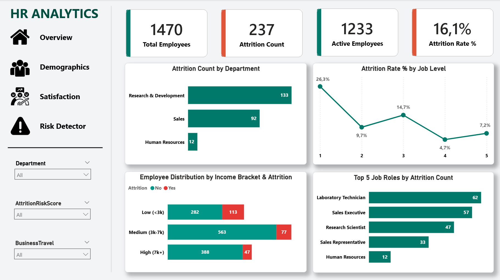
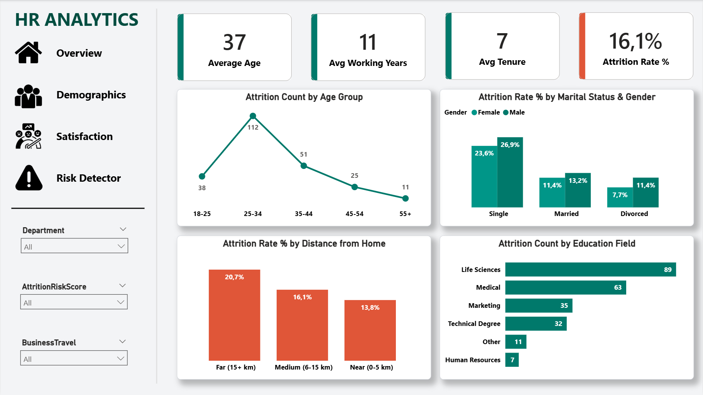
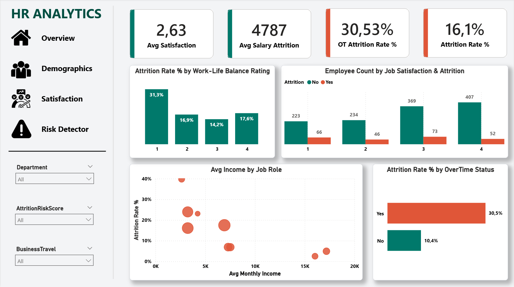
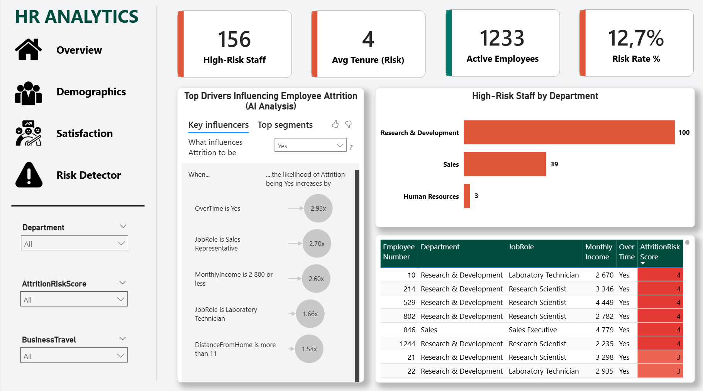
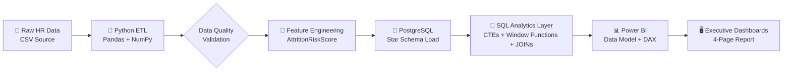
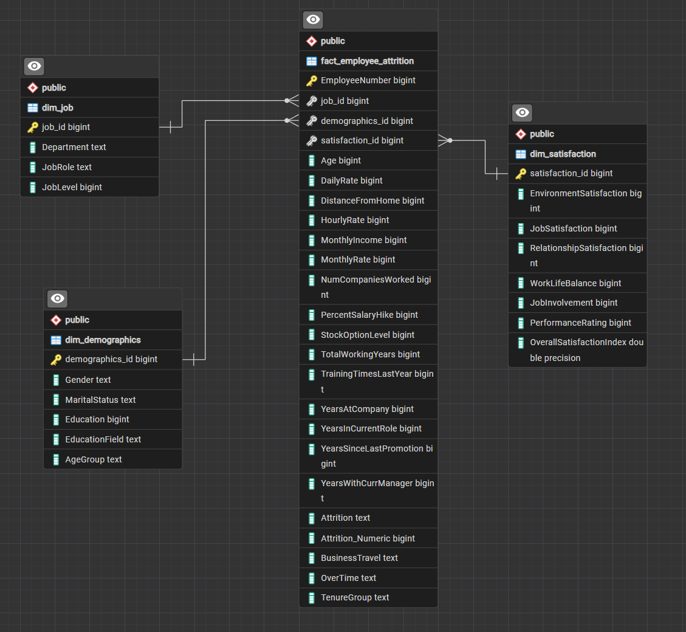

<div align="center">

# 🧬 Enterprise HR Analytics & Attrition Risk Intelligence System

### *Turning Workforce Data Into Retention Strategy*

<p>
  
  
  
  
  
  
</p>

<p>
  
  
  
  
  
</p>

<br/>



<br/><br/>

*A full-stack, end-to-end People Analytics solution — from raw HR records to a production-grade Power BI Command Center — engineered to quantify, explain, and predict employee attrition risk.*

</div>

<br/>

---

## 📌 Executive Summary

Employee attrition is one of the most expensive and least understood problems in modern organizations — replacement costs routinely run between 50% and 200% of an employee's annual salary, yet most HR teams still react to resignations rather than anticipate them.

The **Enterprise HR Analytics & Attrition Risk Intelligence System** is a complete analytics pipeline that transforms raw, unstructured HR data into a governed, queryable, and visually intelligent decision-support system. It was built to answer one core executive question:

> **"Which employees are about to leave, why are they leaving, and how much is it costing us?"**

This project moves through three professional analytics layers:

| Layer | Tool | Purpose |
|:---|:---|:---|
| **1. Cleaning & Feature Engineering** | Python (Pandas, NumPy) | Raw data ingestion, validation, transformation, and generation of a proprietary `AttritionRiskScore` |
| **2. Structured Storage & Querying** | PostgreSQL + pgAdmin 4 | Normalized relational storage, advanced SQL analytics (CTEs, window functions, JOINs) |
| **3. Business Intelligence & Reporting** | Power BI + DAX | Star-schema semantic model, interactive dashboards, executive-ready KPIs |

### 🔑 Headline Findings

<table>
<tr><td>🚨</td><td><b>45.45%</b> attrition rate among OverTime staff with the lowest Work-Life Balance rating — over <b>5x</b> the rate of non-overtime, high work-life-balance peers (8.45%)</td></tr>
<tr><td>💰</td><td>Departing <b>Managers</b> earned <b>$3,500–$5,300 less</b> than their active peers in the same role, exposed via <code>AVG() OVER (PARTITION BY "JobRole")</code></td></tr>
<tr><td>📉</td><td><b>Sales Executives</b> represent the single largest financial exposure — <b>$426,873/month</b> in lost payroll investment from 57 departures</td></tr>
<tr><td>🎯</td><td><b>156 active employees (12.7%)</b> currently sit in the High-Risk cohort (<code>AttritionRiskScore ≥ 3</code>) and require immediate retention intervention</td></tr>
<tr><td>🧬</td><td>Male employees from <b>Technical Degree</b> and <b>Marketing</b> educational backgrounds show elevated attrition of <b>27.50%</b> and <b>22.22%</b> respectively</td></tr>
</table>

<br/>

---

## 🎨 Interactive Dashboard Preview

The Power BI report (`report/HR_Analytics.pbix`) is organized into four purpose-built pages, each engineered around a distinct HR decision-making persona — from the C-suite overview to the granular risk-scoring command center.

<br/>

<div align="center">

### 🏠 Overview — Executive Workforce Snapshot


<br/><br/>

### 👥 Demographics — Workforce Composition & Segmentation


<br/><br/>

### 😊 Satisfaction & Pay — Engagement vs. Compensation Analysis


<br/><br/>

### 🎯 Risk Detector — Attrition Risk Command Center


</div>

<br/>

---

## 🔄 End-to-End Data Pipeline

The system follows a strict, reproducible **ETL → Relational Modeling → Semantic Layer** architecture, ensuring every number seen on the executive dashboard is traceable back to a single governed source of truth.



### Pipeline Stage Breakdown

| Stage | Description | Key Techniques |
|:---|:---|:---|
| **Extraction** | Raw HR dataset ingested via `pandas.read_csv()` inside `scripts/hr_analytics_eda.ipynb` | Schema inspection, dtype casting, encoding checks |
| **Cleaning** | Null handling, duplicate removal, categorical standardization (e.g., `OverTime`, `MaritalStatus`, `EducationField`) | `.isnull()`, `.duplicated()`, `.map()`, `.astype()` |
| **Feature Engineering** | Construction of the composite **`AttritionRiskScore`** from weighted behavioral and compensation signals (OverTime, Work-Life Balance, Job Satisfaction, Salary Gap, Tenure) | Vectorized NumPy scoring logic, conditional binning |
| **Loading** | Cleaned, feature-enriched DataFrames split across fact/dimension frames and loaded into PostgreSQL using `psycopg2` / SQLAlchemy `to_sql()` | Batch inserts, primary/foreign key constraint enforcement |
| **Transformation (SQL)** | Business-logic queries executed directly in PostgreSQL via pgAdmin 4 | CTEs, `PARTITION BY` window functions, JOINs across fact and dimension tables |
| **Modeling & Reporting** | PostgreSQL tables imported into Power BI, related into a Star Schema, and enriched with DAX measures | Star schema relationships, DAX (`CALCULATE`, `DIVIDE`, `RANKX`) |

<br/>

---

## 📐 Database Schema & Data Modeling

<div align="center">

<p><i>Fig. 1 — Star Schema ERD generated from PostgreSQL (pgAdmin 4)</i></p>
</div>

<br/>

The database is intentionally modeled as a **Star Schema** — the industry-standard architecture for analytical (OLAP) workloads — consisting of **one central Fact Table** and **three supporting Dimension Tables**. This design minimizes query complexity, maximizes Power BI performance via single-directional relationships, and mirrors how real enterprise data warehouses are structured.


```

### 📋 Table Reference

| Table | Type | Grain | Primary/Foreign Keys | Key Fields |
|:---|:---:|:---|:---|:---|
| **`fact_employee_attrition`** | Fact | 1 row per employee snapshot | `job_id` (FK), `demographics_id` (FK), `satisfaction_id` (FK) | `"MonthlyIncome"`, `"Attrition"`, `"OverTime"`, `"AttritionRiskScore"` |
| **`dim_job`** | Dimension | 1 row per role/department | `job_id` (PK) | `"JobRole"`, `"Department"`, `"JobLevel"` |
| **`dim_demographics`** | Dimension | 1 row per employee | `demographics_id` (PK) | `"Gender"`, `"Age"`, `"MaritalStatus"`, `"EducationField"` |
| **`dim_satisfaction`** | Dimension | 1 row per satisfaction profile | `satisfaction_id` (PK) | `"WorkLifeBalance"`, `"JobSatisfaction"` |

**Why a Star Schema?**
- ✅ Denormalized dimensions → faster DAX aggregations, fewer join hops
- ✅ Single Fact Table enforces one clear grain, preventing double-counting in `SUM()` measures
- ✅ Directly compatible with Power BI's VertiPaq engine best practices
- ✅ Scales cleanly if additional fact tables (e.g., `fact_recruitment`, `fact_performance`) are added later

> **Note:** Column names were created with mixed-case identifiers in PostgreSQL (e.g., `"JobRole"`, `"MonthlyIncome"`), which means they must always be referenced in **double quotes** in SQL — unquoted identifiers are automatically lower-cased by Postgres and will raise a `column does not exist` error.

<br/>

---

## 💡 Advanced SQL Analytics & Business Insights

All queries below live in [`sql/queries.sql`](sql/queries.sql) and were executed in **PostgreSQL via pgAdmin 4**, joining across the `fact_employee_attrition`, `dim_job`, `dim_demographics`, and `dim_satisfaction` tables. Each query pairs a specific analytical technique with a concrete business finding.

<br/>

### 1️⃣ OverTime & Work-Life Balance Interaction

**Technique:** JOIN to `dim_satisfaction` + conditional aggregation with `CASE WHEN`.

```sql
SELECT
    f."OverTime",
    s."WorkLifeBalance",
    COUNT(*) AS total_employees,
    SUM(CASE WHEN f."Attrition" = 'Yes' THEN 1 ELSE 0 END) AS total_departures,
    ROUND(
        100.0 * SUM(CASE WHEN f."Attrition" = 'Yes' THEN 1 ELSE 0 END) / COUNT(*),
        2
    ) AS attrition_rate_pct
FROM fact_employee_attrition f
JOIN dim_satisfaction s ON f.satisfaction_id = s.satisfaction_id
GROUP BY f."OverTime", s."WorkLifeBalance"
ORDER BY attrition_rate_pct DESC;
```

**📊 Finding:** Employees who work **OverTime** *and* report the lowest **Work-Life Balance** rating (`1`) churn at a staggering **45.45%** — compared to just **8.45%** for employees who don't work overtime and report high work-life balance. This is a **5.4x risk multiplier** and the single strongest behavioral predictor of attrition in the dataset.

<br/>

### 2️⃣ Salary Gap Analysis via Window Functions

**Technique:** JOIN to `dim_job` + `AVG() OVER (PARTITION BY "JobRole")` to benchmark each individual against their role's peer average without collapsing row-level detail.

```sql
WITH salary_benchmark AS (
    SELECT
        f."EmployeeID",
        j."JobRole",
        f."Attrition",
        f."MonthlyIncome",
        AVG(f."MonthlyIncome") OVER (PARTITION BY j."JobRole") AS avg_role_income,
        f."MonthlyIncome" - AVG(f."MonthlyIncome") OVER (PARTITION BY j."JobRole") AS income_gap
    FROM fact_employee_attrition f
    JOIN dim_job j ON f.job_id = j.job_id
)
SELECT
    "JobRole",
    ROUND(AVG(income_gap), 2) AS avg_income_gap_departed
FROM salary_benchmark
WHERE "Attrition" = 'Yes'
GROUP BY "JobRole"
ORDER BY avg_income_gap_departed ASC;
```

**📊 Finding:** Departing **Managers** earned between **$3,500 and $5,300 less** than the average of their currently-active peers in the same role. This exposes a **pay equity risk** — the company is disproportionately losing its underpaid talent within critical leadership roles, rather than losing performers at random.

<br/>

### 3️⃣ Financial Cost Impact by Job Role

**Technique:** JOIN to `dim_job` + CTE + aggregate multiplication to translate headcount loss into monthly payroll exposure.

```sql
WITH departed_costs AS (
    SELECT
        j."JobRole",
        COUNT(*) AS departures,
        ROUND(AVG(f."MonthlyIncome"), 2) AS avg_income,
        ROUND(COUNT(*) * AVG(f."MonthlyIncome"), 2) AS total_monthly_payroll_lost
    FROM fact_employee_attrition f
    JOIN dim_job j ON f.job_id = j.job_id
    WHERE f."Attrition" = 'Yes'
    GROUP BY j."JobRole"
)
SELECT *
FROM departed_costs
ORDER BY total_monthly_payroll_lost DESC;
```

**📊 Finding:**

| Job Role | Departures | Avg. Income | Monthly Payroll Lost |
|:---|:---:|---:|---:|
| **Sales Executive** | 57 | $7,489 | **$426,873** 🔴 |
| **Laboratory Technician** | **62** 🔴 (highest volume) | — | — |

While **Laboratory Technicians** lead in raw departure **volume** (62 exits), **Sales Executives** inflict the greatest **financial** damage — bleeding **$426,873 per month** in lost payroll investment. This distinction matters strategically: volume-based attrition calls for process fixes, while cost-based attrition calls for immediate compensation and retention intervention.

<br/>

### 4️⃣ High-Risk Active Employee Cohort

**Technique:** Filtered aggregation against the engineered `"AttritionRiskScore"` feature (stored directly on the fact table) to isolate employees who haven't left yet — but are statistically primed to.

```sql
SELECT
    COUNT(*) AS high_risk_employees,
    ROUND(
        100.0 * COUNT(*) / (
            SELECT COUNT(*) FROM fact_employee_attrition WHERE "Attrition" = 'No'
        ),
        2
    ) AS pct_of_active_workforce
FROM fact_employee_attrition
WHERE "Attrition" = 'No'
  AND "AttritionRiskScore" >= 3;
```

**📊 Finding:** **156 currently active employees (12.7% of the active workforce)** carry an `AttritionRiskScore ≥ 3`. This cohort represents the organization's **actionable retention target list** — the group where a well-timed HR intervention has the highest probability of preventing a resignation before it happens.

<br/>

### 5️⃣ Demographic Vulnerability Analysis

**Technique:** JOIN to `dim_demographics` + multi-dimensional `GROUP BY` across `"Gender"` and `"EducationField"` to surface intersectional attrition patterns.

```sql
SELECT
    d."Gender",
    d."EducationField",
    COUNT(*) AS total_employees,
    SUM(CASE WHEN f."Attrition" = 'Yes' THEN 1 ELSE 0 END) AS departures,
    ROUND(
        100.0 * SUM(CASE WHEN f."Attrition" = 'Yes' THEN 1 ELSE 0 END) / COUNT(*),
        2
    ) AS attrition_rate_pct
FROM fact_employee_attrition f
JOIN dim_demographics d ON f.demographics_id = d.demographics_id
GROUP BY d."Gender", d."EducationField"
HAVING COUNT(*) > 10
ORDER BY attrition_rate_pct DESC;
```

**📊 Finding:** **Male employees** with a **Technical Degree** background churn at **27.50%**, and those with a **Marketing** background churn at **22.22%** — both significantly above the company-wide baseline. This signals a possible mismatch between role expectations and career-path satisfaction for these specific education-field segments.

<br/>

---

## 🎯 Strategic HR Recommendations & Executive Action Plan

<table>
<thead>
<tr>
<th>Priority</th>
<th>Insight Driving It</th>
<th>Recommended Action</th>
<th>Expected Impact</th>
</tr>
</thead>
<tbody>
<tr>
<td>🔴 <b>P1 — Immediate</b></td>
<td>45.45% attrition among OverTime + low Work-Life Balance staff</td>
<td>Enforce OverTime caps in high-load departments; mandate WLB pulse surveys for any employee logging &gt;X hours/month</td>
<td>Directly targets the single largest attrition driver identified in the dataset</td>
</tr>
<tr>
<td>🔴 <b>P1 — Immediate</b></td>
<td>156 employees (12.7%) flagged as High-Risk</td>
<td>Launch a proactive "Stay Interview" program for the identified cohort within 30 days, prioritized by <code>AttritionRiskScore</code></td>
<td>Converts a reactive exit-interview culture into a preventative retention culture</td>
</tr>
<tr>
<td>🟠 <b>P2 — Short-Term</b></td>
<td>Departing Managers paid $3,500–$5,300 below peer average</td>
<td>Conduct a compensation equity audit for all Manager-level roles; align at-risk salaries to the role's <code>AVG()</code> benchmark</td>
<td>Addresses a root-cause pay-equity gap before it triggers further leadership attrition</td>
</tr>
<tr>
<td>🟠 <b>P2 — Short-Term</b></td>
<td>Sales Executives cost $426,873/month in lost payroll</td>
<td>Introduce a retention bonus / accelerated commission structure specifically for the Sales Executive role</td>
<td>Protects the highest financial-exposure job role in the business</td>
</tr>
<tr>
<td>🟡 <b>P3 — Structural</b></td>
<td>62 Laboratory Technician departures (highest volume)</td>
<td>Review onboarding, workload distribution, and career-progression paths specific to lab roles</td>
<td>Reduces high-volume churn and lowers recurring recruitment/training costs</td>
</tr>
<tr>
<td>🟡 <b>P3 — Structural</b></td>
<td>Elevated attrition in Technical Degree (27.50%) & Marketing (22.22%) backgrounds</td>
<td>Re-evaluate role-fit during hiring for these education fields; introduce targeted mentorship tracks</td>
<td>Improves long-term role alignment and reduces early-tenure exits</td>
</tr>
</tbody>
</table>

<br/>

---

## 📊 Dashboard UI/UX Architecture & Page Specs

The `.pbix` report was designed with a **persona-driven page architecture** — every page answers a different stakeholder's question, from the CHRO down to the retention specialist.

### 🏠 Page 1 — Overview
> *Audience: C-Suite / CHRO — "How healthy is our workforce, at a glance?"*
- Top-line KPI cards: Total Headcount, Overall Attrition Rate, Average Tenure, Total Monthly Payroll
- Attrition trend by Department (bar/column chart)
- YoY / QoQ attrition trend line
- Company-wide filter bar (Department, Job Role, Date)

### 👥 Page 2 — Demographics
> *Audience: HR Business Partners — "Who is leaving, structurally?"*
- Attrition rate broken down by Gender, Age Band, Marital Status
- Education Field vs. Attrition Rate matrix
- Headcount distribution by Department & Job Level (treemap / donut)

### 😊 Page 3 — Satisfaction & Pay
> *Audience: Compensation & Total Rewards teams — "Are we paying and treating people fairly?"*
- Job Satisfaction vs. Attrition Rate correlation chart
- Salary Gap visual (Departed vs. Active, by Job Role) — powered by the Query #2 window function logic
- Work-Life Balance vs. OverTime heat matrix (visualizing the 45.45% peak finding)

### 🎯 Page 4 — Risk Detector (Command Center)
> *Audience: Retention Task Force — "Who do we act on, right now?"*
- Drillable employee-level table filtered to `AttritionRiskScore ≥ 3`
- Risk Score distribution histogram
- KPI card: 156 High-Risk Employees (12.7% of active workforce)
- Conditional formatting (🔴🟡🟢) driven by DAX-calculated risk tiers
- Drill-through to individual employee profile cards

<br/>

---

## 📂 Repository Structure

```
HR-Analytics-Attrition-Risk-Intelligence/
│
├── assets/
│   ├── page1_overview.png        # Overview dashboard page screenshot
│   ├── page2_demographics.png    # Demographics dashboard page screenshot
│   ├── page3_satisfaction.png    # Satisfaction & Pay dashboard page screenshot
│   ├── page4_risk_detector.png   # Risk Detector Command Center screenshot
│   └── postgresql_erd.png        # PostgreSQL Star Schema ERD diagram
│
├── report/
│   └── HR_Analytics.pbix         # Power BI report file
│
├── scripts/
│   └── hr_analytics_eda.ipynb    # Python cleaning, EDA & feature engineering
│
├── sql/
│   └── queries.sql               # All advanced SQL analytics queries
│
├── .gitignore
├── LICENSE
└── README.md
```

<br/>

---

## 🚀 Reproduction & Setup Guide

Follow these steps to fully reproduce the pipeline locally, from raw data to interactive dashboard.

### ✅ Prerequisites

| Requirement | Version / Notes |
|:---|:---|
| Python | 3.10+ |
| PostgreSQL | 14+ |
| pgAdmin 4 | Latest stable |
| Power BI Desktop | Latest (Windows only) |
| Jupyter Notebook / JupyterLab | Latest |

### Step 1 — Clone the Repository

```bash
git clone https://github.com/<your-username>/HR-Analytics-Attrition-Risk-Intelligence.git
cd HR-Analytics-Attrition-Risk-Intelligence
```

### Step 2 — Set Up the Python Environment

```bash
python -m venv venv
source venv/bin/activate        # Windows: venv\Scripts\activate
pip install pandas numpy jupyter sqlalchemy psycopg2-binary
```

### Step 3 — Run the Cleaning & Feature Engineering Notebook

```bash
jupyter notebook scripts/hr_analytics_eda.ipynb
```
Execute all cells top-to-bottom. This will clean the raw dataset, engineer the `AttritionRiskScore` feature, and export the processed fact/dimension tables ready for loading.

### Step 4 — Create the PostgreSQL Database

Open **pgAdmin 4** and create a new database:

```sql
CREATE DATABASE hr_attrition_db;
```

### Step 5 — Load the Star Schema Tables

Using the SQLAlchemy connection defined at the end of the notebook (or via pgAdmin's Import/Export tool), load the four tables in dependency order (dimensions first, then the fact table):

```
dim_job
dim_demographics
dim_satisfaction
fact_employee_attrition
```

### Step 6 — Run the Analytics Queries

Open `sql/queries.sql` inside pgAdmin 4's Query Tool and execute the five core analytical queries to validate the business findings above. Remember that all mixed-case column names (e.g. `"JobRole"`, `"MonthlyIncome"`) must be double-quoted exactly as shown.

### Step 7 — Open the Power BI Report

```
report/HR_Analytics.pbix
```
In Power BI Desktop, go to **Home → Transform Data → Data Source Settings** and point the PostgreSQL connector to your local `hr_attrition_db` instance. Click **Refresh** to rebuild the model with your local data.

### Step 8 — Explore

Navigate across the four report pages (Overview, Demographics, Satisfaction & Pay, Risk Detector) using the tab bar at the bottom of the Power BI report.

<br/>

---

## 👤 Author

**Nihat Rzaquluzade | Junior Data Analyst**

This project was developed as a professional **Data Analytics portfolio project**, demonstrating skills in Python, PostgreSQL, ETL processes, data cleaning, SQL analysis, and Power BI data visualization.

[](https://github.com/nihatrza)

[](https://www.linkedin.com/in/nihat-rzaquluzade-624b332a9/)

---

<div align="center">

